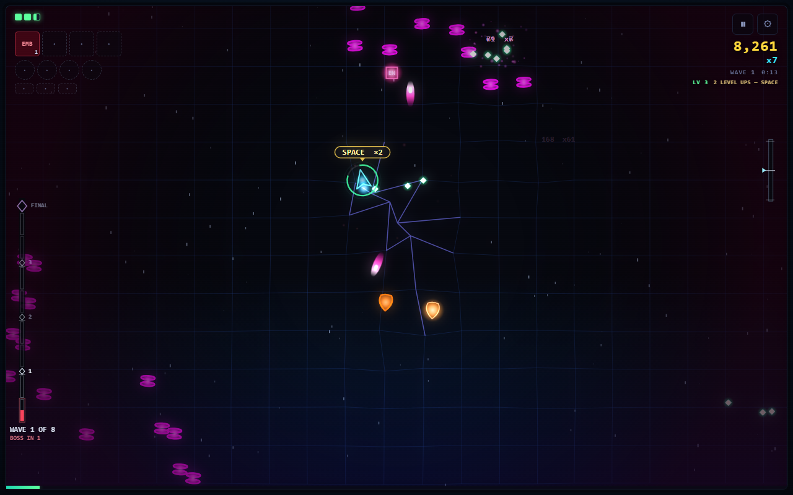

# MusicWars

A bullet hell whose soundtrack is not a file. There is no recorded music in
this repository — not one loop, not one bar. Every note is decided in the
browser by [Strudel](https://strudel.cc) and arranged in real time from what is
happening on screen.

Almost all of it is synthesis — oscillators and noise. Two things are sampled,
and both are fetched at runtime with a synthesised fallback underneath. The
**drum kit** is nine one-shots from Strudel's drum-machine set — a Roland TR-909
kick, snare, clap, closed and open hat and rim, an 808 kick and cabasa, a
LinnDrum hat — 267 KB in all, landing about a quarter of a second after START
on a warm connection and about three seconds cold; until then, and offline for
good, the oscillator kit plays (`src/audio/samples.ts`). The other is the
**bass**, which plays a sampled fingered electric bass
(`gm_electric_bass_finger`) fetched at runtime from
[webaudiofontdata](https://felixroos.github.io/webaudiofontdata/): one file,
9.7 KB gzipped. Nothing waits for it — the game starts on the sawtooth that lane
always used and swaps the instrument in underneath once the samples are decoded
— under a second warm, about four seconds cold, measured with all seven roles'
fonts loading (`src/audio/soundfonts.ts`) — and **if the fetch fails the lane
keeps its sawtooth**, so the game works with no network at all.

Four other instruments are mapped and ready in
[`src/audio/soundfonts.ts`](src/audio/soundfonts.ts) and are switched OFF: a
build that put an oboe on the melody and a choir on the harmony was heard and
described as "carnival". The table records what each would be and why; enabling
one is a single line. `node tools/fontcheck.mjs --spectrum` is the measurement.

**The ensemble on stage is the mix.** Each weapon you hold is an instrument
playing its part, each enemy archetype has a motif, and the density of the
screen drives the tension model that decides how hard the track goes.



```bash
npm install && npm run dev
```

Then open <http://localhost:5173>. The ship never stops: **W**/**S** are a
throttle, **A**/**D** or the arrows steer, and the band fires on its own.
**Shift** focuses, **X** bombs, **C** opens a black hole, and **Space** spends
the level-ups you have banked. Hold **W** for 1.4 s to WARP — the wave clock
runs about 9× faster, the stage floods, and the boss comes sooner.

---

## The game

A bullet hell on a treadmill. The field is 3000 wide and unbounded along the
track; the camera is a rail along the track that follows you across it. Enemies
never shoot: they come from behind you, they hurt you by touching you, and they
are slower than you are — dozens on screen in normal play, hundreds alive under
warp. Killing them drops XP; each level banks an offer of four cards.

A run is 16 waves in four acts, with a boss every fourth wave — three minis and
then THE FINAL SET, and beating it ends the run. Runs are stages on a set list:
twelve of them, each the same sixteen waves under more pressure, and every run
pays points to spend in the shop between them.

**30 instruments** built from composable properties — burn, freeze, poison,
bleed, chain, slow, split, leech, quake — and **103 authored arrangements**
made by fusing an instrument with a rig item or with another instrument. Every
one of the 435 instrument pairs combines into something; the unauthored ones
inherit both parents' properties. A new save drafts 8 of the instruments and 8
of the 12 rig items; the rest are bought in the shop.

Fusing frees a slot. You hold four instruments and four rig items, so the only
way to keep growing is to combine what you already have.

The design owes its shape to Vampire Survivors and Ball x Pit, and the weapon
mechanics are ported from them rather than invented — see
[`docs/plan-refactor-3.md`](docs/plan-refactor-3.md) §9.

## The music

`src/audio/layers.ts` builds every lane; `src/audio/director.ts` turns game
state into musical state. The simulation never talks to Strudel — it emits
events and publishes a numeric snapshot, and the director reads it.

The bass is the protagonist: the sampled pluck with a wobble under it. A motor
pulse keeps the clock and never drops out, a stab comps the chord's guide
tones, the lead is the line that follows you, and the kit plays around them.

Weapons are lanes in the mix, so a loadout is audible. Some read the transport
back: RASP fires only on the off-beat, SORDINO silences two of your own lanes
for two bars and banks the damage, INTERLUDE takes the whole band out for two
bars.

## Development

```bash
npm run dev        # vite, localhost:5173
npm run build      # typecheck + bundle
npm run verify     # the full gate suite
```

Around 200 verification tools live in `tools/`, most written after a specific
defect got past the previous ones. `tools/capture.mjs` renders the real audio
chain to a WAV; `tools/arena.mjs` plays 20-minute bot runs and reports density
and encirclement; `tools/builds.mjs` measures whether the card you pick changes
the run.

**Read [`AGENTS.md`](AGENTS.md) before changing anything.** It records the traps
— several "obvious" improvements are documented there as measured failures.

## Layout

| path | what it is |
|---|---|
| `src/game/weapons.ts` | weapons, properties, fusion recipes |
| `src/game/world.ts` | the simulation |
| `src/audio/layers.ts` | every instrument lane |
| `src/audio/director.ts` | game state → musical state |
| `src/render/` | canvas renderer and HUD |
| `tools/` | the verification suite |
| `docs/` | plans, research, and what each measurement contradicted |
